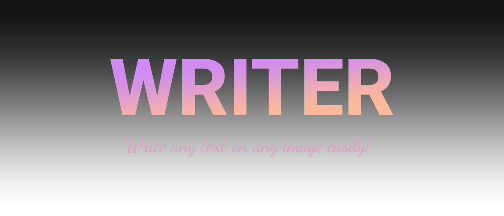

# 

Writer is a simple and easy-to-use package to write any text on images. It uses [harfbuzz](https://github.com/harfbuzz/harfbuzz) for shaping and also works totally fine on bi-directional texts.

> [!NOTE]
> _Writer_ is currently work-in-progress and also looking for feedback.

## Getting started:

### Requirements:

To get started using _Writer_, you should first have the latest version of [Harfbuzz](https://github.com/harfbuzz/harfbuzz) installed on your machine. You also need pkg-config for [go-harfbuzz](https://github.com/haashemi/go-harfbuzz).

### Installation

```
go get github.com/haashemi/writer@main
```

### Code example:

There are a few examples in the [examples folder](./example/), but here's one:

```go
package main

import (
	"image"
	"image/png"
	"os"

	"github.com/haashemi/writer"
)

func main() {
	// Load face from the font file
	face := writer.NewFaceFromFile("./font.ttf")
	defer face.Close()

	// Create a font from the face
	font := writer.NewFont(face, 45)
	defer font.Close()

	// Create a new writer instance.
	w, _ := writer.NewWriter(font, "Hello World!", writer.Options{})
	defer w.Close()

	// Create a new image. (doesn't matter how.)
	img := image.NewNRGBA(w.Bounds())

	// Write it on your image
	w.Write(img, w.Bounds(), image.White)

	// Save the image. (doesn't matter how.)
	f, _ := os.Create("basic/result.png")
	png.Encode(f, img)
}
```

### Result:


## Contributions:

All types of contributions are highly appreciated. especially giving me feedback on its API and how I can make it better, simpler, and easier to use.
